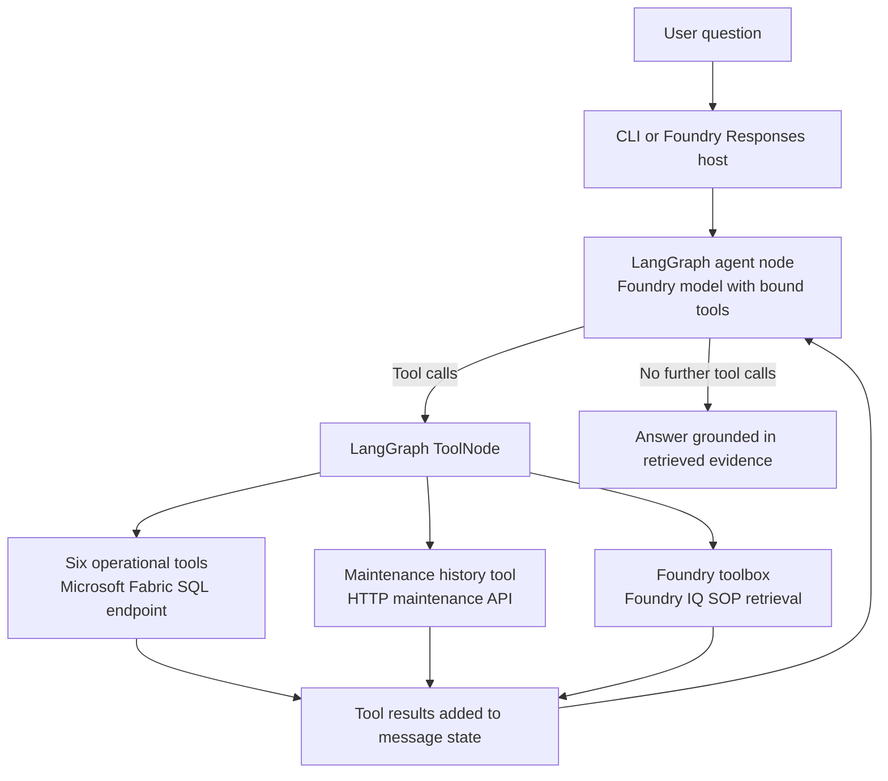

# Manufacturing Operations Investigation Agent

A portfolio project connecting **Microsoft Fabric**, **Microsoft Foundry**, and a **LangGraph agent** to investigate manufacturing performance across production, downtime, quality, inventory, and maintenance data. Seven operational tools retrieve structured evidence, while a Foundry IQ knowledge-base tool provides retrieval-augmented generation (RAG) over standard operating procedures (SOPs).

The aim is to help answer **“Why did the plant miss its target?”**, not just **“What was its output?”**

## Why this project matters

A dashboard can show that a plant missed its production target. Explaining the miss often requires someone to compare production output, downtime logs, maintenance records, and inventory status across separate systems.

This agent brings those sources into one investigation. It can identify the line responsible for a shortfall, inspect the machines that stopped, check whether maintenance is overdue, and consider inventory as a contributing factor. It can also retrieve written procedures when the question concerns required servicing or escalation.

The portfolio value is **cross-system evidence gathering and synthesis**: connecting an operational event in one source with relevant history in another. This is decision support for an analyst or plant manager; an inferred explanation still needs to be distinguished from a proven physical root cause.

No measured time-saving claim is made here. An earlier estimate that a manual investigation could take “an hour or more” was informal. A defensible comparison would time the same investigation manually and through the agent, including checks that both answers are complete and accurate.

## Architecture



| Component | Responsibility |
| --- | --- |
| Microsoft Fabric | Supplies cleaned production, downtime, machine, quality, and inventory tables through a SQL endpoint. |
| Microsoft Foundry | Provides the model endpoint and the configured SOP retrieval toolbox; the repository also includes a hosted-agent deployment configuration. |
| LangGraph | Controls the agent/tool execution loop and accumulates messages and tool results. |
| Operational tools | Run predefined, parameterized SQL queries or call the maintenance API. The model selects tools and arguments rather than writing arbitrary SQL. |
| Foundry IQ / SOP knowledge base | Retrieves written procedures to support answers about rules, service intervals, required actions, and escalation. |
| Mock maintenance API | Represents a separate maintenance system using bundled JSON data and FastAPI. |

The maintenance integration is a **mock system for this demo**, not a connection to a real client's maintenance platform. Fabric tables and the SOP knowledge base are external prerequisites and are not provisioned by the Python code in this repository.

## How the agent works

1. **Receive the question.** The user submits a question through the CLI or the hosted Responses interface.
2. **Select evidence sources.** The Foundry model receives the system prompt, conversation messages, and tool definitions. It chooses which tools to call and supplies their arguments.
3. **Execute tools.** LangGraph's `ToolNode` executes the requested calls and appends their results to `MessagesState`.
4. **Continue the investigation.** The graph returns to the agent node. The model can use the evidence to request additional information, such as maintenance records for a machine identified in downtime events.
5. **Produce the answer.** When the model returns a response without tool calls, the graph ends.

The graph is a tool-calling loop, not a fixed sequence of seven steps. A simple lookup may need one tool; a “why” question may require several sources. The system prompt directs cause-related investigations to check the size of the miss, the affected line, downtime, maintenance for repeatedly stopped machines, and inventory.

The prompt also tells the model to report exact figures, acknowledge unavailable data, avoid repeated identical calls, and use at most eight tool calls per question. These are **prompt instructions**, not separate programmatic enforcement of an eight-call limit.

### The seven operational tools

| Tool | Source | What it returns |
| --- | --- | --- |
| `get_production_performance` | Fabric | Plant target, actual output, variance, and attainment percentage for a date. |
| `get_line_performance` | Fabric | The same metrics by line, ordered by worst variance first. |
| `get_downtime_events` | Fabric | Downtime events, machine IDs, reason codes, and total minutes by line; optionally filtered to one line. |
| `get_machine_events` | Fabric | Machine details and downtime over an inclusive date range, including event counts and minutes by reason. |
| `get_quality_defects` | Fabric | Defect quantities grouped by date, machine, and defect type; optionally filtered by plant or machine, with a maximum of 100 rows. |
| `get_inventory_status` | Fabric | Stock on hand, reorder points, and whether each item is below its reorder point. |
| `get_maintenance_history` | Maintenance HTTP API | Service schedules, calculated next due dates, recent maintenance records, and work orders for a machine. |

### SOP retrieval with Foundry IQ

RAG means retrieving relevant source material before generating an answer. Here, operational tools answer **what happened**, while SOP retrieval answers **what the written procedure requires**.

When `TOOLBOX_NAME` is configured, `AzureAIProjectToolbox` loads the tools exposed by that Foundry toolbox. The agent binds them alongside the seven operational tools and adds instructions to use SOP retrieval for procedural questions and name the SOP document used.

The intended setup includes a Foundry IQ SOP retrieval tool. The code dynamically loads whatever tools the configured toolbox exposes, so the total registered tool count depends on that configuration. This repository contains the integration, not the knowledge-base contents or its indexing setup.

If the toolbox cannot load at startup, the code logs a warning and continues with the seven operational tools. This preserves structured-data investigation, but SOP retrieval is unavailable for that process.

## Example investigation: CNC-104

**Question:** “Why did Plant 2 miss its target on October 1, 2026?”

An investigation can move from plant performance to line performance, then connect downtime events for a relevant machine with its maintenance history. Inventory provides another source to check before assigning the entire miss to one explanation.

The CNC-104 case illustrates that connection: the project investigation links downtime evidence with overdue servicing in the separate maintenance system. The bundled maintenance fixture contains these specific facts:

- CNC-104 belongs to Plant 2, Line 3 in its maintenance records and work orders.
- Its coolant-system service interval is 90 days, with a last service date of March 12, 2026. The API therefore calculates a next due date of June 10, 2026, which is overdue relative to the demo date of October 1.
- An open corrective work order dated September 29 records a high spindle-temperature alarm, low coolant, a coolant top-up, and the machine returning to service for monitoring.

Together, these records give the agent a maintenance-related explanation to investigate alongside downtime. They do not, by themselves, prove the physical failure mechanism or quantify lost output. Production shortfall figures and downtime totals must come from the Fabric tools; they are not embedded in this README.

An SOP follow-up could ask: **“What does the written procedure require for this machine's coolant servicing?”** The agent would then retrieve the relevant SOP rather than treating a work-order note as a procedural rule.

## Evaluation results

The following results are recorded from the project evaluation notes supplied by the author. Evaluation scripts, case files, and saved run artifacts are **not included in this checkout**, so these scores have not been independently rerun from this repository.

### Two evaluation runs

| Run | Test version | Interpretation |
| --- | --- | --- |
| Run 1 | Original held-out cases | Three tests were judged too strict in the project review. The original result artifact includes a filename ending in `heldout-2117.json`; numeric results for this run are not reproduced here. |
| Run 2 | Cases with three tests edited | The reported scores below use the corrected tests. Because the tests were edited after observing Run 1, this is **not a pristine held-out score**. |

The original `heldout_cases.jsonl` was overwritten during that work. Preserve the Run 1 results, the retained copy of the original tests, the revised cases, and the Run 2 results together. Label each run by test version and record exactly what changed; timestamps alone do not explain the difference.

### Reported Run 2 scores

| Metric | Score | Required threshold | Result |
| --- | ---: | ---: | --- |
| Tool selection | 1.00 | 0.90 | PASS |
| Tool arguments | 1.00 | 0.90 | PASS |
| Evidence completeness | 1.00 | 0.85 | PASS |
| Evidence retrieved | 1.00 | Not supplied | — |
| Groundedness | 1.00 | 0.95 | PASS |
| Hallucination free | 1.00 | 1.00 | PASS |
| Root cause accuracy | 0.80 | 0.80 | PASS |

The supplied evaluation notes describe approximately 15 answerable questions and report that the agent handled unseen questions well and acknowledged missing data. They also identify a weakness: **the agent can overstate risk when the evidence is thin**. The root-cause score and that finding support improving uncertainty calibration rather than claiming reliable causal diagnosis in every situation.

Perfect scores on these evaluated cases do not imply that every future answer will be correct. Evaluator definitions and the original/revised case comparison should accompany the artifacts before drawing broader conclusions.

## Scope and known limitations

The demo prompt covers three plants and production data from **September 2 to October 1, 2026**, treating **October 1, 2026 as “today.”** This is a fixed demo context, not a live date-aware production system.

| Question category | Current behavior and evidence |
| --- | --- |
| Answerable operational questions | Lookups and investigations supported by the seven tools are covered by the supplied evaluation notes. |
| Missing data | The prompt directs the agent to say the information is unavailable and avoid calculating a substitute. The supplied notes identify N-03 and H-10 as missing-data checks, including a prompt fix for N-03. |
| Questions unrelated to manufacturing | No explicit domain refusal is implemented or evaluated. The model may respond as a general chatbot. A client-facing version should add and test a manufacturing-only scope rule. |
| SOP/procedure questions | Supported when the Foundry toolbox loads. No separate SOP retrieval evaluation scores were supplied. |

Unavailable data includes OEE, hourly or shift data, SKU/product data, sensor data, operator data, and alarm logs. A maintenance work-order description mentioning an alarm does not provide access to an alarm-log system.

Other implementation limits:

- Inventory below its reorder point indicates a stock concern; it does not establish that a shortage stopped production.
- Quality retrieval returns at most 100 grouped rows, so broad date ranges can omit results.
- Each CLI question starts a new graph invocation. There is no configured persistent conversation store or LangGraph checkpointer.
- The tools read data; they do not schedule maintenance, change inventory, or close work orders.
- The container configuration demonstrates packaging for Foundry hosting. Its presence alone does not establish that a deployment is currently running.

## Run locally

### Prerequisites

- Python 3.12, matching the Docker image.
- A Microsoft Foundry project with an accessible model deployment; the code defaults to `gpt-5-mini`.
- A Fabric SQL endpoint with the expected tables and permission to query them.
- An Azure identity available to `DefaultAzureCredential` and the SQL driver's `ActiveDirectoryDefault` authentication. For local development, an authenticated Azure CLI session is one possible credential source.
- Optional: a configured Foundry SOP toolbox for RAG.

The required Fabric tables are:

```text
dbo_cleaned.production_targets_cleaned
dbo_cleaned.production_output_cleaned
dbo_cleaned.downtime_events_cleaned
dbo_cleaned.machines_cleaned
dbo_cleaned.quality_defects_cleaned
dbo_cleaned.inventory_cleaned
```

The exact column names and query contracts are defined in [tools.py](tools.py). Fabric data-loading scripts and SOP ingestion assets are not included here.

### 1. Install dependencies

From the repository root in PowerShell:

```powershell
python -m venv .venv
.\.venv\Scripts\Activate.ps1
python -m pip install -r requirements.txt
```

### 2. Configure a local `.env`

```dotenv
AZURE_AI_PROJECT_ENDPOINT=https://<resource>.services.ai.azure.com/api/projects/<project>
MODEL_DEPLOYMENT_NAME=gpt-5-mini
FABRIC_SQL_SERVER=<fabric-sql-endpoint>
FABRIC_DATABASE=<database-name>

# Optional: enable the configured SOP retrieval toolbox.
TOOLBOX_NAME=<toolbox-name>

# Optional: point to a separately running maintenance system.
# MAINTENANCE_API_URL=http://127.0.0.1:8000
```

`FOUNDRY_PROJECT_ENDPOINT` is accepted as a fallback for `AZURE_AI_PROJECT_ENDPOINT`. Credentials are resolved through Azure authentication rather than a model API key in this code. Keep `.env` out of version control.

### 3. Ask a question through the CLI

For investigations involving maintenance, start the bundled API in one terminal:

```powershell
python -m uvicorn api_server:app --host 127.0.0.1 --port 8000
```

In another terminal, with the virtual environment activated:

```powershell
python agent.py "How did Plant 2 perform on October 1, 2026?"
python agent.py "Why did Plant 2 miss its target on October 1, 2026?"
```

The CLI prints tool calls, truncated tool results, and the final answer. These are observable execution records, not hidden model reasoning.

### 4. Run the Responses host

```powershell
python host.py
```

The host serves the graph through `ResponsesHostServer` on port `8088` by default, with the local Responses endpoint at `http://127.0.0.1:8088/responses`. Set `PORT` to override the port.

When `MAINTENANCE_API_URL` is **unset**, `host.py` starts the bundled maintenance API automatically. When the variable is set, it assumes the configured maintenance service is already running. Setting it to localhost does not trigger automatic startup.

## Container and Foundry hosting

[Dockerfile](Dockerfile) packages the Python application and maintenance fixture using Python 3.12, installs the Linux libraries required by the SQL driver, and runs under an unprivileged user. Configuration and credentials must be supplied at runtime.

```powershell
docker build -t manufacturing-agent .
docker run --rm -p 8088:8088 --env-file .env manufacturing-agent
```

A local Azure CLI login on the host is not automatically available inside the container. Container execution requires an Azure credential source accessible inside that environment and permissions for the connected services.

[azure.yaml](azure.yaml) declares a Foundry hosted agent, the Responses protocol, a model deployment, and container resource settings. It references a project-specific endpoint and must be adapted for another Azure environment. The YAML supplies `AZURE_AI_MODEL_DEPLOYMENT_NAME`, while `agent.py` reads `MODEL_DEPLOYMENT_NAME`; the current default is `gpt-5-mini`, but a custom model name needs those settings aligned.

## Repository guide

| File | Purpose |
| --- | --- |
| [agent.py](agent.py) | System prompt, Foundry model, toolbox loading, LangGraph definition, and CLI entry point. |
| [tools.py](tools.py) | Seven operational tools and Fabric/maintenance connections. |
| [api_server.py](api_server.py) | FastAPI mock maintenance endpoint. |
| [mock_api/maintenance_data.json](mock_api/maintenance_data.json) | Demo maintenance schedules, records, and work orders. |
| [host.py](host.py) | Responses hosting entry point and automatic mock API startup. |
| [verify_toolbox.py](verify_toolbox.py) | Diagnostic script to list toolbox tools and try an SOP search; contains project-specific settings. |
| [requirements.txt](requirements.txt) | Pinned Python dependencies. |
| [Dockerfile](Dockerfile) | Container packaging. |
| [azure.yaml](azure.yaml) | Foundry project and hosted-agent configuration. |

## What this project demonstrates

- Connecting an agent to enterprise structured data in Microsoft Fabric.
- Using a Foundry-hosted model to select typed tools and assemble evidence.
- Orchestrating iterative tool use with LangGraph.
- Combining SQL, an HTTP API, and SOP retrieval within one investigation.
- Keeping event evidence separate from written procedural requirements.
- Evaluating tool use, evidence coverage, groundedness, and root-cause explanations, while reporting changes to the test set transparently.
- Packaging the application for a hosted Responses interface.

The strongest next improvements are to preserve and publish versioned evaluation artifacts, test SOP retrieval and out-of-domain handling, enforce tool-call limits in code, and improve how the agent distinguishes a supported hypothesis from a confirmed cause.
